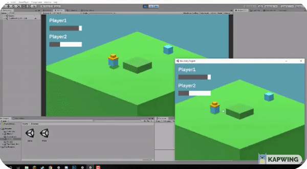

# MyPhotonGame
Multiplayer Game with Lobby system and ability to create room

I created a multiplayer real-time casual game based on Photon Engine and Unity.

The player has the ability to join/create a lobby. The objective of the game is to steal the HAT from the other player.

